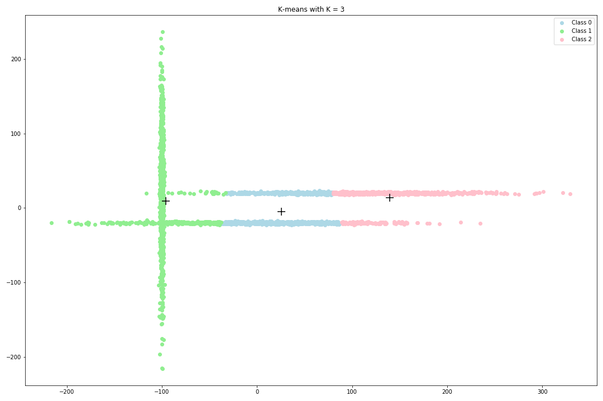
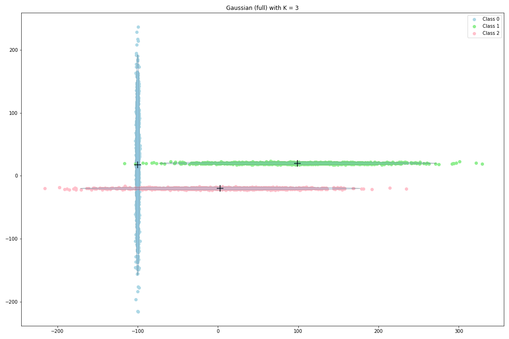

# EM algorithm on a GMM versus K-means algorithm

This repository contains a comparison between two unsupervised learning methods: the EM-based-GMM and K-means algorithms. This work was done at the MVA master (2020) with Fabien Pesquerel for the course 'Probabilistic Graphical Models' taught by Pierre Latouche and Nicolas Chopin.

After a bit of theory, the algorithms K-means and EM (Expectation-Maximization) on a GMM (Gaussian Mixture Model) are compared on the iris dataset.

Enjoy!

As a take away message, consider the following two figures. The EM algorithm based on a GMM performs much better than K-means when the classes cannot be captured inside a ball.

